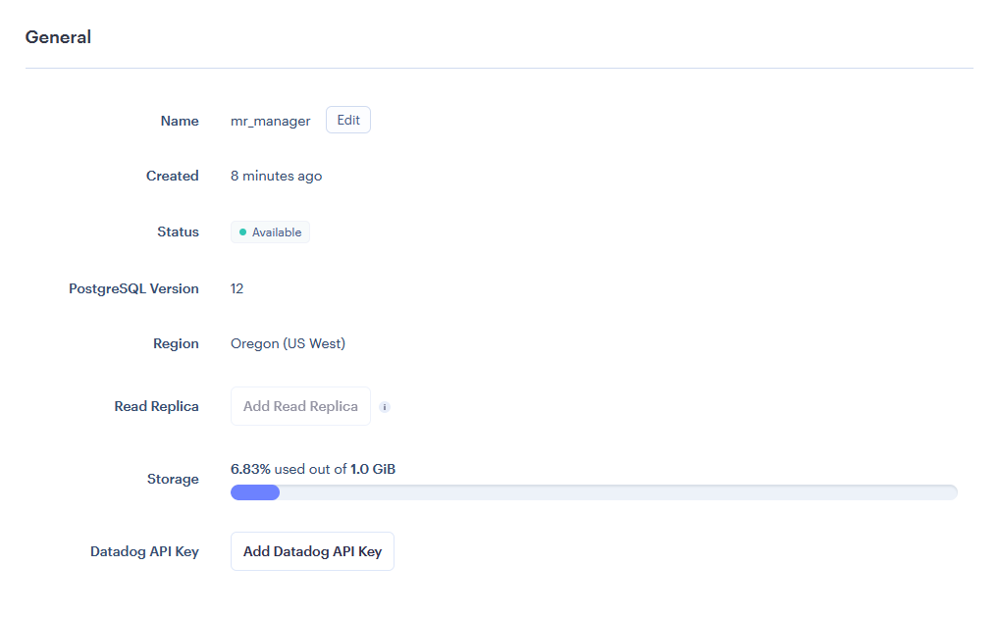
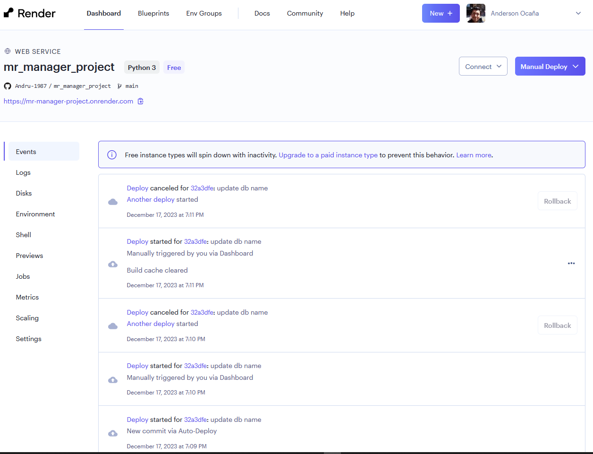
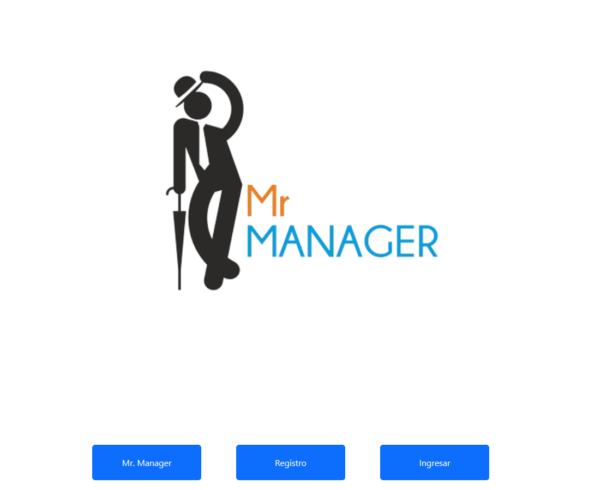
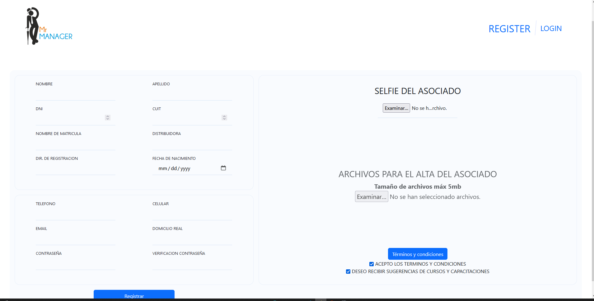

# Configuración del Proyecto Django - MR Manager

## Descripción
Este archivo contiene la configuración principal para el proyecto MR Manager en Django. Incluye las aplicaciones instaladas, la configuración de bases de datos, la configuración de archivos estáticos y más.

## PROYECTO MR MANAGER
Sistema de gestión de usuarios es una plataforma dinámica que impulsa el crecimiento mediante capacitaciones y una valiosa información sobre la jerarquía en el ámbito de las tecnologías de la información.

## Configuración Principal

- **Clave Secreta**:
  - Se obtiene del entorno a través de `os.environ.get("SECRET_KEY")`.
- **Modo de Depuración**:
  - Configurado dinámicamente mediante `os.environ.get("DJANGO_DEBUG", 1)`.
- **Hosts Permitidos**:
  - Configurados en función de la variable de entorno `ALLOWED_HOSTS`.

## Aplicaciones Instaladas
Se definen aplicaciones personalizadas y las aplicaciones de Django como:
- `app_no_user` : Para manejar personas que no tienen acción dentro del proyecto, son agentes externos, asi como noticias y novedades
- `app_beneficios`: Son los beneficios de los usuarios registrados, Cursos, Biblioteca Técina y Normativas
- `app_manager_user` : Son los usuarios,(cuentan con el nombre anterior del proyecto)
- `app_consulta` : Son los que nos permiten hacer consultas directamente con alguno de los representantes del proyecto.
- `app_cuota` :  Son valores de cuptas que se otorgan de manera mensual o por tipo de curso o data extra que se realiza tanto como una posible consulta

## Middleware Personalizado
Se agrega middleware personalizado, como el middleware de Cors (`app_manager_user.middleware_cors.CorsMiddlewareMixin`), a la lista de middlewares.

## Configuración de Base de Datos
Se utiliza una base de datos cuyos detalles se obtienen de las variables de entorno (`os.getenv`). Se permite la configuración para múltiples motores de base de datos.

La base de datos elegida fue la de postgresql: Servicio otorgado por Render, plataforma gestionada en la nube
Otra de las bases temporales que se puede usar de desarrollo es la SQLITE.

## Configuración de Plantillas
Se configura el directorio de plantillas (`templates`) y se establece `APP_DIRS` como `True` para buscar plantillas en las aplicaciones instaladas.

## Archivos Estáticos
Se establece el manejo de archivos estáticos mediante Whitenoise para servir archivos estáticos.

## Configuración de Sesiones y Autenticación
Se establece la duración de las sesiones, redireccionamiento después del inicio y cierre de sesión, y se configuran los orígenes de confianza para CSRF.

## Otros Detalles
- Se define el modelo de usuario de autenticación personalizado.
- Se establecen parámetros de internacionalización y zonas horarias.

---

**Nota:** Asegúrate de revisar y ajustar los valores de configuración si es que se desea usar el proyecto en alguna parte fuera de argentina


## [PRESENTACION DEL PROYECTO EN CANVAS](https://www.canva.com/design/DAF3MhHxBHo/n7u36ABg2afyTDv__rcj-A/view)


## PASOS DEL DEPLOY A RENDER 

- Creacion de la base de datos en Render >> 

Si es necesario de manera local o si es pago el servicio, hacer un import de algún dump, siendo la version de PG 12 
```
  psql databasename < data_base_dump

```

- Creación de la WebApp:


Al ser un proyecto basado en renderización del tipo in box, puede llegar a tener algunas problematicas tales como el manejo de los staticos, por lo que se trabaja con whitenoise y pillow, que son dependecias que nos ayuda a manejar las imagenes.


### [DEPLOY DE MR MANAGER](http://mrmanager.pythonanywhere.com/)






